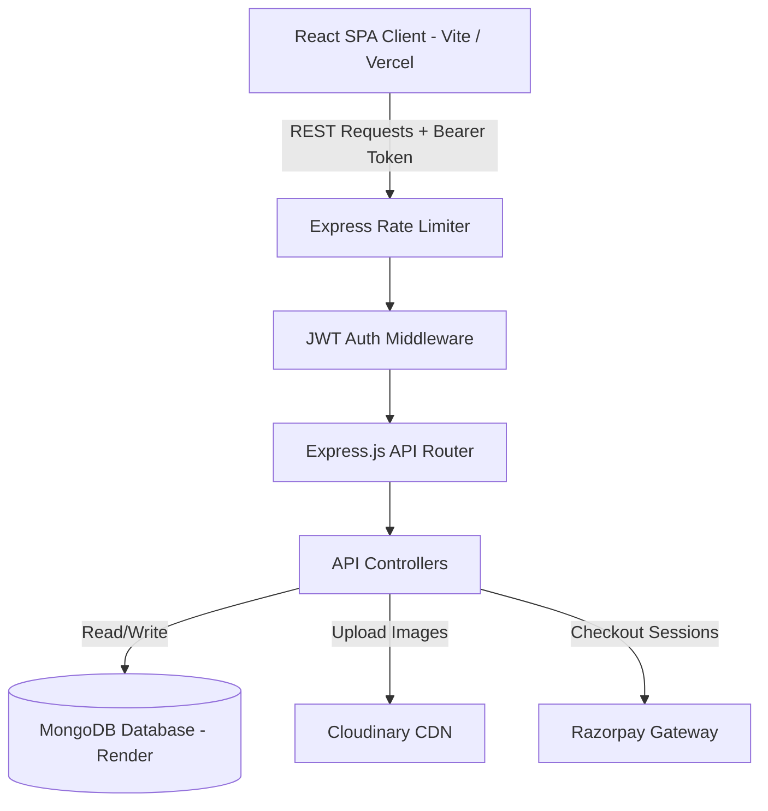
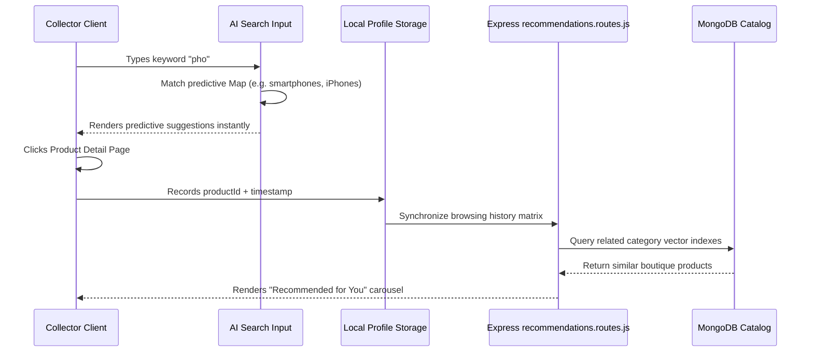

# 🛒 VendorHub | AI-Powered Multi-Vendor Marketplace

<div align="center">
  
  [](https://react.dev)
  [](https://vite.dev)
  [](https://react.dev)
  [](https://nodejs.org)
  [](https://expressjs.com)
  [](https://mongodb.com)
  [](https://opensource.org/licenses/MIT)

  <p align="center">
    <strong>A next-generation, high-performance, and scalable multi-vendor e-commerce platform curated for elite boutique curators and patron collectors, featuring predictive analytics and production-grade security.</strong>
  </p>

  <h4>
    <a href="#-project-overview">Overview</a> ✦
    <a href="#-system-architecture">Architecture</a> ✦
    <a href="#-core-features">Features</a> ✦
    <a href="#-installation--setup">Setup</a> ✦
    <a href="#-api-documentation">API Docs</a> ✦
    <a href="#-security-features">Security</a>
  </h4>
</div>

---

## 📖 Project Overview

**VendorHub** is a production-grade, high-fidelity multi-vendor marketplace designed to connect elite boutique curators with passionate collectors. Built utilizing the robust **MERN (MongoDB, Express, React, Node.js)** stack, the platform incorporates high-performance architectural systems, fluid micro-interactions, responsive analytical interfaces, and top-tier security standards.

Unlike typical monolithic marketplaces, VendorHub focuses on micro-boutiques, localized dispatch routing (centered around prominent hubs in Bandra, Juhu, Colaba, and Powai), and an interactive seller panel featuring real-time revenue splits and live storefront preview custom cards.

---

## ⚠️ The Problem Statement

Traditional multi-vendor platforms suffer from major pain points:
1. **Convoluted Storefront Management**: Aspiring independent merchants find it incredibly complex to configure brand visions, handle pricing formulas, and customize catalog appearances dynamically.
2. **AI Tech Jargon Bloat**: E-commerce pages are often cluttered with sci-fi buzzwords (e.g. *"Ledger Node Syncing"*), reducing trust and professionalism.
3. **Rigid Logistics & Inflexible Dispatches**: Multi-vendor platforms rarely support local hub-based select shipping directories, making neighborhood dispatch optimization complex.
4. **Poor Admin Auditing Trails**: Admins lack clear, unified directories and modal drawers to review merchant credentials, suspend malicious stores, or activate compliant partners.

## 💡 The Solution

VendorHub solves these bottlenecks through a refined, recruiter-ready architecture:
* **Tactile Boutique Curators Panel**: Direct dispatch hub selectors, live-updating catalog previews, and drag-and-drop simulated sales metrics.
* **Streamlined UI & Human Copywriting**: Replaced tech-jargon with a highly premium, warm champagne-tinted dark aesthetic designed to highlight product imagery.
* **Hub-Based Shipping Nodes**: Native virtual categorizations (Home, Work, Boutique Hub, Warehouse) utilizing a clever, database-safe suffix system that doesn't require schema migrations.
* **Merchant Administration & Governance Control**: An exclusive portal for system administrators to search registered vendors, review compliance dossiers, toggle storefront clearances, and suspend/activate accounts with instant feedback.

---

## 🎯 Core Features

### 🧠 AI Features
* **Predictive Smart Search Bar**: Dynamic autocompletion logic that predicts queries in real-time (e.g., typing "phone" predicts "smartphones, iPhones, Android phones") and incorporates fuzzy keyword matchings.
* **Dynamic Recs Engine**: Local storage browsing history metrics that build custom buyer profiles to tailor checkout suggestions and boutique recommendations.

### 🛍️ Buyer (Collector Member) Features
* **Clean Explore Board**: Filter items by categories, search matching keywords, and browse curated merchant galleries.
* **Premium Address book**: Set up multiple delivery addresses categorized by colorful hover badges.
* ** tactical Switches**: sliding custom toggle controls for default shipping nodes and tactile checkout selectors.
* **Boutique Curatorship Upgrade**: A step-by-step seller partnership form where buyers can instantly apply, calculate take-home splits, write their brand visions, and submit their files for admin reviews.

### 🏪 Seller (Boutique Curator) Features
* **Real-time Boutique Dashboard**: Manage product inventories, create new boutique items, and track orders.
* **Visual Storefront Preview Card**: As you edit your storefront name, hub location, or narrative, watch a public preview card update in real-time.
* **Interactive Commission Calculator**: Slide sales estimators and visualize a graphical split detailing take-home curator revenue (92%), gatekeeper cuts (8%), and listing saver benefits.

### 🛡️ Admin (Director) Features
* **Universal Merchant Registry**: Search curators by name, email, storefront name, or location.
* **Governance Credentials Board**: Instantly approve pending storefront audits or suspend malicious accounts.
* **Active Security Audit Logs**: Track active platform sessions, log logins, and revoke hijacked device nodes instantly.

---

## 💻 Tech Stack

| Layer | Technology | Usage |
| :--- | :--- | :--- |
| **Frontend** | React 19, Vite 8 | UI compilation, state synchronizations, high-performance rendering |
| **Styling** | Tailwind CSS 3 | Fluid responsive visual layouts, glassmorphism, floating backdrops |
| **Animation** | Framer Motion 12 | Smooth page transitions, slider estimator calculations, popup overlays |
| **State Manager** | Redux Toolkit | Centralized authentication, cart counts, wishlist indicators |
| **Backend** | Node.js, Express.js | High-performance RESTful API controllers, rate-limiters |
| **Database** | MongoDB, Mongoose | Relational document tracking, indexing, strict data validation |
| **Payments** | Razorpay SDK | Curated checkout verification, order ledger creation |
| **Storage** | Cloudinary API | High-resolution boutique catalog product asset hosting |
| **Deployment** | Vercel (Client), Render (Server) | Globally accessible production hosting grids |

---

## 🏗️ System Architecture

VendorHub incorporates a scalable decoupled architecture. The frontend React client communicates with the Node/Express backend API server via secure SSL CORS protocols:



### 🧠 Dynamic AI Search & Recommendation Data Flow



---

## 📂 Folder Structure

```
VendorHub/
├── package.json              # Root Monorepo configuration
├── client/                   # Frontend SPA Environment
│   ├── package.json
│   ├── vite.config.js        # Vite compilation rules
│   ├── tailwind.config.js    # Custom brand palettes, fonts, animate-blobs
│   ├── public/
│   └── src/
│       ├── main.jsx          # Entrypoint initializing Redux providers
│       ├── App.jsx           # Decoupled public & private layout routes
│       ├── index.css         # Custom ambient blobs, glassmorphism, scrollbars
│       ├── components/       # Universal reusable components
│       │   ├── ui/           # Custom premium Buttons, Switch Toggles
│       │   ├── Navbar.jsx    # Refined header search and floating bottom menu
│       │   └── AISearchInput.jsx
│       ├── layouts/          # Auth layouts, Dashboard structures
│       ├── lib/              # Dynamic loaders and top bar indicators
│       ├── pages/            # Core views
│       │   ├── ProfilePage.jsx # Overhauled premium account manager
│       │   ├── ExplorePage.jsx
│       │   └── LandingPage.jsx
│       ├── redux/            # Auth and Cart slices
│       └── services/         # Axios central API configurations
└── server/                   # Backend Server Environment
    ├── package.json
    ├── app.js                # Core API gateway, CORS, and rate limiters
    ├── config/               # DB connection engines
    ├── constants/            # Role definitions (Buyer, Seller, Admin)
    ├── controllers/          # Business logic engines
    ├── middleware/           # Auth and Role verification
    ├── models/               # MongoDB models (User, Product, Order, Cart)
    ├── routes/               # API endpoints
    └── utils/                # Standardized ApiResponses & ApiErrors
```

---

## 🚀 Installation & Setup

### Prerequisites
* **Node.js** (v18.0.0 or higher recommended)
* **MongoDB** (Local instance or MongoDB Atlas cluster connection string)
* **Git** installed on your system

### 1. Clone the Repository
```bash
git clone https://github.com/tanujexe/VendorHub.git
cd VendorHub
```

### 2. Configure Backend Server Environment
```bash
cd server
npm install
```
Create a `.env` file inside the `server/` directory and configure the variables:
```env
PORT=5000
MONGO_URI=mongodb+srv://<username>:<password>@cluster0.mongodb.net/vendorhub
JWT_SECRET=your_jwt_super_secret_signing_key_here
NODE_ENV=development

# Third Party Integrations
CLOUDINARY_CLOUD_NAME=your_cloudinary_cloud_name
CLOUDINARY_API_KEY=your_cloudinary_api_key
CLOUDINARY_API_SECRET=your_cloudinary_api_secret

RAZORPAY_KEY_ID=your_razorpay_key_id
RAZORPAY_KEY_SECRET=your_razorpay_key_secret
```

### 3. Configure Frontend Client Environment
```bash
cd ../client
npm install
```
Create a `.env` file inside the `client/` directory and configure the target backend connection API url:
```env
VITE_API_URL=http://localhost:5000/api
```

---

## 🎮 Running the Platform

### Running the Backend Server
```bash
cd server
npm run dev # Starts node backend server at http://localhost:5000
```

### Running the Frontend Client
```bash
cd client
npm run dev # Starts Vite development server at http://localhost:5173
```

---

## 🔌 API Documentation Examples

All API requests accept and return JSON payloads. Protected routes require authorization bearer headers (`Authorization: Bearer <token>`).

### Auth Directory Endpoints

| Endpoint | Method | Security | Payload Parameters | Response Summary |
| :--- | :--- | :--- | :--- | :--- |
| `/api/auth/register` | `POST` | Public | `{ name, email, password, role }` | Registers user, returns JWT and user profile |
| `/api/auth/login` | `POST` | Public | `{ email, password }` | Authenticates curator, returns JWT cookie |
| `/api/auth/me` | `GET` | Protected | None | Returns the active curator's profile data |
| `/api/auth/me` | `PATCH` | Protected | `{ name, email, storeName, addresses }` | Updates profile metadata |

### Admin Oversight Directory Endpoints

| Endpoint | Method | Security | Action |
| :--- | :--- | :--- | :--- |
| `/api/admin/users?role=seller` | `GET` | Admin Only | Fetches platform merchant profiles |
| `/api/admin/users/:id/toggle-active`| `PATCH` | Admin Only | Instantly suspends/activates curator access |
| `/api/admin/vendors/:id/approve` | `PATCH` | Admin Only | Approves merchant storefront catalogs |
| `/api/admin/vendors/:id/reject` | `PATCH` | Admin Only | Revokes merchant storefront catalog approvals |

---

## 🔒 Security Features (Production-Grade)

1. **Authentication Protection & Middleware Verification**:
   All private route actions verify secure JSON Web Tokens (JWT) inside an isolated header bearer parser middleware. Express controllers immediately intercept unauthorized requests, protecting catalog settings and transaction logs.
2. **API Rate Limiting Shield**:
   Express rate-limiting acts as a perimeter shield against DDoS attacks. Limiters are set strictly on brute-force sensitive routes (e.g., login and register limiters cap attempts at 5 requests per 15 minutes).
3. **Database Input Sanitizations & Strict Validators**:
   MongoDB payload structures utilize robust express-validator parameters to sanitize emails, passwords, and addresses, block JavaScript injections, and prevent SQL/NoSQL schema corruptions.
4. **Curator Access Revocation Protocol**:
   Under Profile settings, curators can view device operating systems, IP logs, and login dates to audit security trails, with the capability to immediately terminate secondary device nodes.

---

## 📸 Interface Screenshots Placeholder

<div align="center">
  


</div>

---

## 🚀 Deployment Instructions

### Frontend SPA Deployment on Vercel
1. Install Vercel CLI or login to your Vercel Dashboard.
2. Link the repository, select the `/client` directory as the deployment root.
3. Configure the **Build Command** to `npm run build` and **Output Directory** to `dist`.
4. Setup `VITE_API_URL` pointing to your hosted Render backend server api root.

### Backend Server Deployment on Render
1. Create a new **Web Service** on Render and link the GitHub repository.
2. Set the root directory to `/server`.
3. Set the **Start Command** to `npm start`.
4. Configure all environment variables in the **Environment** settings panel (DB string, secrets, APIs).

---

## 🔮 Future Roadmap Improvements
- [ ] **Multi-Lingual Storefront Support**: Expand dispatch localization profiles beyond Mumbai South boundaries.
- [ ] **Native QR Invoice Generators**: Instant boutique physical slip generation directly under checkout logs.
- [ ] **Direct Courier Integrations**: Real-time Dunzo/Borzo routing calculations integrated dynamically with our dispatch hub categories.

---

## 🎓 Learning Outcomes
- Developed highly decoupled multi-role access controls (Buyer, Seller, Admin) integrated smoothly inside modular React private layout trees.
- Mastered NoSQL database optimizations, establishing efficient compound indexes for product searches and address directories.
- Leveraged framer-motion calculators and dynamic sliding splits to translate financial business metrics into satisfying micro-animations.
- Engineered safe suffix database-saving mechanisms (`street | tag`), demonstrating how to introduce production features without altering legacy MongoDB schemas.

---

## 🤝 Contribution Guidelines

We welcome independent curators and open-source engineers to help make VendorHub better.
1. **Fork** the project repository.
2. Create a new feature branch: `git checkout -b feature/gorgeous-visual-upgrade`
3. Commit your changes: `git commit -m "Added a stunning neon slider effect"`
4. Push your branch: `git push origin feature/gorgeous-visual-upgrade`
5. Submit a **Pull Request** detailing your changes.

---

## 📄 License
This project is licensed under the MIT License - see the [LICENSE](LICENSE) file for details.

---

## ✍️ Author
* **Tanuj** - Lead System Architect & UI Designer - [@tanujexe](https://github.com/tanujexe)

---

## ⭐ Support
If you find this project recruiter-friendly or inspiring, please consider giving the repository a **Star** on GitHub! It helps other developers find this project.
